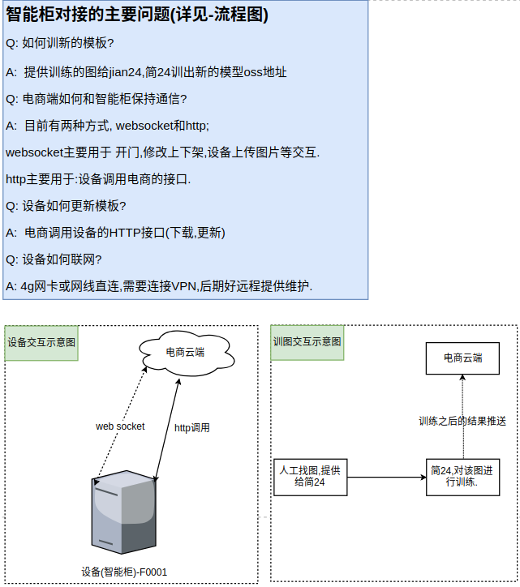

# 设备对接的相关接口

## 1. 交互格式定义如下

**交互格式定义如下-(为了 "可读性"  我故意添加的空格,实际没的)**

**用途type** | **唯一ID**  | **机器设备ID** | **JSON内容**
```
<MESSAGE_TYPE>|<UUID>|<STORE_CODE>|<JSON_FORMAT_MESSAGE>
```

**用途type** :  

**1 => ** 给服务端 处理数据;   1 => 硬件发送给服务端的信息

**举例：** 发送内容  1 | ab52450d-6760-4160-8308-87be741995f0 | F00001 | {"message":"SUCCESS"}  给服务端。服务端根据 ‘1’ 判断是设备发送的命令处理请求,吧 唯一ID 对面的数据表的记录更新为处理成功。

**2 =>**  给设备端 处理数据;   2 => 服务端发送给硬件的信息

**举例：** 发送内容 2 | ab52450d-6760-4160-8308-87be741995f0 | F00001 | {"command":"OPEN_DOOR", "user_id":"28872", "time":"1547632502502"}  给设备端。设备端 根据 ‘2’ 判断是服务端发送的业务处理指令，进行自己的业务处理，完毕再进行反馈。

**请求(示例):**
```
开⻔ 1|8d18eb85-f466-480e-9910-60e79af37f2f|F0001|{"command":"OPEN_DOOR", "user_id":"28872", "time":"1547632502502"}
拍照 1|a8992550-f318-42fc-a47d-e592eb3caf4c|F0001|{"command":"TAKE_PHOTO"}
```
**响应(示例)**
```
开⻔ 2|8d18eb85-f466-480e-9910-60e79af37f2f|F0001|{"message":"SUCCESS"}

拍照 2|a8992550-f318-42fc-a47d-e592eb3caf4c|F0001|{"message":"SUCCESS"}
```


## 2. 相关的接口交互

##### 1. 设备启动进行服务端连接


**连接** : ws://ws.xxx.com/proxy_trans?id=F0001

- 后面id是设备的唯一ID

`注意点`
- 1.websocket 20 ping pong （每间隔20s发起一次 长连接心跳）
- 2.ping 60 websocket (间隔60s收不到心跳响应，就关闭长连接)

------------


##### 2.设备开门

**服务端** => **设备端**  OPEN_DOOR

`例：`
```
1 | ab52450d-6760-4160-8308-87be741995f0-5555 | F00001 | {"command":"OPEN_DOOR", "user_id":"28872", "time":"1547632502502"}
```
------------


##### 3.设备拍照命令

**服务端** => **设备端**  TAKE_PHOTO

`例：`
```
1 | ab52450d-6760-4160-8308-87be741995f0 | F00001 | {"command":"TAKE_PHOTO"}
```

`注意点`
- 1.设备接受命令之后，拍照上传到阿里云OSS，然后把地址传给客系统里面存储。


##### 3.1 设备上下架命令

**服务端** => **设备端**  UPON_CHANGE

`例：`
```
1 | ab52450d-6760-4160-8308-87be741995f0 | F00001 | {"command":"UPON_CHANGE"}
```

`注意点`
- 1.设备接受命令之后，会去调用电商的商品接口，这个接口会返回商品列表，设备用这个列表，生成自己的product-info 文件，用于算法识别。

------------
##### 4.用户关闭柜门

**服务端** <= **设备端**  

**注意点** : `HTTP请求`  `POST方法` `JSON数据`

`例：`

- 1.定义API地址 http://portal-test.jian24.openread.cn/api/portal/dev/close
- 2.用户关闭门后，设备将会发出HTTP请求到 “1” 的url上，推送的内容格式如下

```
{
	 "store_code": "F0037",
	 "user_id": 1035,
	 "evt_data": [{
		 "barcode": "6902827100069",
		 "count": 2
		}],
	"extra_data":{
		"difficult":1,
		"op_type":"buy",
		"uuid":"7e684c3e-9b2e-4811-84d0-cef8ca70bf11-9487"
	}
}
```
- 3.**store_code** 冷柜代码,**user_id** 开门时候传给设备的用户id，**barcode** 商品唯一码，**count** 数量

------------

##### 5.设备更新模型以及下载模型

`下载模型` 

```
1.我们推送训练好的模型文件，提供过去
2.他们将这个文件放入柜子的 约定好的 文件目录下即可

```
`更新模型` 

```
1.将下载好的模型文件，移到发布目录
2.执行算法重启命令

```
> 回调地址用于 通知服务端是否操作完毕，返回SUCCESS
